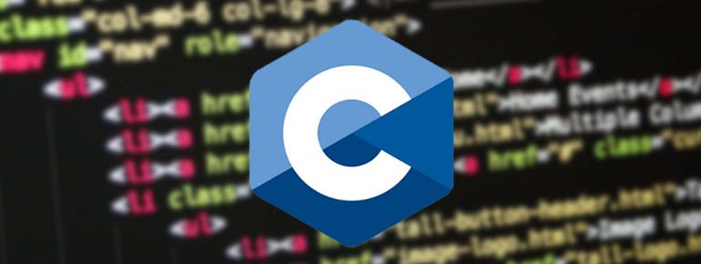

  <h1>Programación en C de Cero a Experto</h1>
  
  <h3 style="font-weight:bold;" >Programación en C de Cero a Experto con Estructuras de Datos (44H)</h3>
  <h5></h5>

## Requisitos :clipboard:
* Conocimiento básico de programación es necesario
* Poder realizar instalaciones en el equipo como administrador
* Se puede lanzar el contenido del curso en OSX (Mac), Windows o Linux.
* Conocimiento de Git necesario.
* **Nota :** prework usado **Clion**

## Comenzando 🚀 

En este curso se desplegara en github los ejemplos sin llaves privadas que puedan ser usadas para desplegar otros servicios anexos a el.

Todos los proyectos seras usados por objetos exportables y ignorados a la hora de subirse en el .gitignore 

## Descripción :notebook:

**Aprender C 2022**

Este curso tiene por objetivo llevarte de cero conocimiento de c hasta un nivel competitivo en el ambiente laboral de hoy en día. Este curso está construido 100% en c.

## Listado de Temas del Curso: 💯 

    *   Sc01 - Introduccion
    *   Sc02 - Elementos basicos
    *   Sc03 - Operadores y expresiones
    *   Sc04 - Ejercicios operaciones y expresiones
    *   Sc05 - Estructuras de seleccion
    *   Sc06 - Ejercicios Estructuras de Selección
    *   Sc07 - Estructuras de Control con Bucles
    *   Sc08 - Ejercicios Estructuras de Control - Bucles
    *   Sc09 - La librería String.h
    *   Sc10 - Funciones
    *   Sc11 - Ejercicios Funciones
    *   Sc12 - Ejercicios con Recursividad
    *   Sc13 - Arreglos con Listas y Tablas
    *   Sc14 - Ejercicios con Arrays o Arreglos
    *   Sc15 - Ejercicios Algoritmos de Ordenamiento
    *   Sc16 - Estructuras
    *   Sc17 - Ejercicios con Estructuras
    *   Sc18 - Apuntadores
    *   Sc19 - Ejercicios con Pointers o Apuntadores  
    *   Sc20 - Manejo de Archivos
    *   Sc21 - Cadenas
    *   Sc22 - Ejercicios de cadenas
    *   Sc23 - Ejercicios Entradas y salidas por archivos
    *   Sc24 - Headers
    *   Sc25 - Proyecto (Contabilizar Gastos)
    *   Sc26 - Memoria Estática vs Memoria Dinámica
    *   Sc27 - Asignación Dinámica de la Memoria
    *   Sc28 - Algoritmos de ordenamiento
    *   Sc29 - Algoritmos de Busqueda
    *   Sc30 - CLion
    *   Sc31 - Refuerzo Antes de Estructura de Datos
    *   Sc32 - Introducción a las Estructuras de datos
    *   Sc33 - Estructuras de datos dinámicas Lineales
    *   Sc34 - Implementación de la Pila (usando Arreglos)
    *   Sc35 - Implementación de la Cola (usando Arreglos)
    *   Sc36 - Teoria de Listas
    *   Sc37 - Repaso Listas Ligadas
    *   Sc38 - Lista Simplemente Enlazada
    *   Sc39 - Lista Ligada Simplemente Enlazada
    *   Sc40 - Lista ligada circular
    *   Sc41 - Lista ligada doble
    *   Sc42 - Lista ligada Circular doble
    *   Sc43 - Pilas
    *   Sc44 - Colas
    *   Sc45 - Arboles
    *   Sc46 - Grafos
    *   Sc47 - Libros recomendados para fortalecer lo aprendido
    *   Sc48 - Ejercicios de Varias secciones (extras)
     